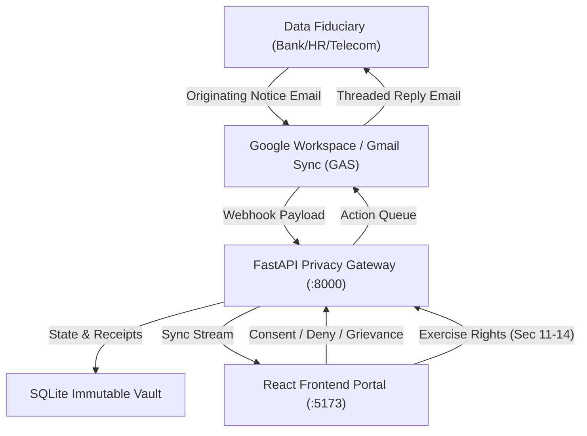

# DPDP Consent Manager — Product Walkthrough & Implementation Plan

**Digital Personal Data Protection Act, 2023 (DPDP Act) Statutory Compliance Platform**  
*Document Version: 2.0.0 | Date: September 2026 | Environment: Production / Staging*

---

## Executive Summary

The **Data Principal (DP) Consent Manager** is an enterprise-grade privacy infrastructure designed to put the individual (**Data Principal**) in complete sovereign control over how their personal data is collected, processed, shared, and retained by **Data Fiduciaries** (banks, fintechs, employers, e-commerce, healthcare providers).

Built strictly in adherence to the **Digital Personal Data Protection (DPDP) Act, 2023**, the platform bridges the gap between raw legal mandates and daily consumer digital experiences by integrating with the Data Principal's real communication channels (e.g., Gmail, SMS, Webhook notifications), providing instantaneous consent decisioning, tamper-evident audit logging, statutory rights fulfillment (Sections 11, 12, 13, 14), and dual-mode responsive UI.



---

## 1. Statutory Alignment & Legal Framework

The platform is purpose-built to comply with key statutory mandates of the **DPDP Act, 2023**:

| Section | Statutory Provision | Platform Implementation |
| :--- | :--- | :--- |
| **Section 5(1)** | Notice Requirement | Standardized statutory notice parsing with Itemized Purpose, Data Attributes list, DPO contact, and retention SLA. |
| **Section 5(3)** | 22 Indic Languages | Real-time multi-lingual switcher supporting English and all 22 Eighth Schedule Indian languages (Hindi, Bengali, Tamil, Telugu, Marathi, Gujarati, Kannada, Malayalam, etc.). |
| **Section 6(1)** | Free, Specific, Informed, Unconditional Consent | Granular attribute selector allowing users to uncheck non-mandatory attributes before granting consent. |
| **Section 6(4)** | Right to Revoke / Withdraw Consent | One-click instant revocation with mandatory notification to Fiduciary and legal confirmation receipt. |
| **Section 11** | Right to Correction & Erasure | Self-service DSR portal to request data updates, completion, or purging of inaccurate records. |
| **Section 12** | Right to Erasure of Data | Automated erasure request dispatcher with SLA tracking (7-day statutory fulfillment window). |
| **Section 13** | Right of Grievance Redressal | Direct grievance filing mechanism generating high-priority alerts to the Data Protection Officer (DPO) and threaded email dispatches. |
| **Section 14** | Right to Nominate | Full self-service statutory nominee designation allowing Data Principals to assign legal representatives in event of death or incapacity. |

---

## 2. System Architecture

The architecture is divided into three decoupled layers:

### A. Core Engine & Data Persistence (Backend)
- **Framework**: FastAPI (Python 3.11+) asynchronous microservice.
- **Database**: SQLite with foreign key enforcement and WAL (Write-Ahead Logging) mode.
- **Tables**:
  - `consents`: Stored notices, statuses (`ACTIVE`, `REVOKED`, `DENIED`), granted attributes, and validity timestamps.
  - `audit_events`: Tamper-evident, hash-chained ledger storing every consent action, IP address, user agent, and cryptographic digest.
  - `data_rights_requests`: DSR statutory request tracker with statutory SLAs (7-day or 30-day compliance windows).
  - `statutory_nominees`: Section 14 legal nominee registry with national ID verification metadata.
  - `fiduciary_notifications`: Outbox queue for outbound emails and webhooks.
- **Security**: SHA-256 digital consent receipts generated on every grant or revocation.

### B. Reactive Experience Layer (Frontend)
- **Tech Stack**: React 18 + Vite + Lucide Icons + Pure CSS3 Design System.
- **State Engine**: `ConsentContext.jsx` with real-time optimistic UI updates and localStorage sync.
- **Color Engine**: Dual-Theme system (`dark` and `light` modes) with CSS custom properties and zero layout shifts.
- **Accessibility & i18n**: Full internationalization dictionary with DPDP Sec 5(3) support.

### C. Live Communications Layer (Gmail Sync & Mailer)
- **Component**: Google Apps Script (`gmail_sync.gs`) + Cloudflare Tunnel Daemon.
- **Polling & Webhooks**: Periodically checks for incoming privacy notices, normalizes email headers, and posts to `/api/gmail-webhook`.
- **Threaded Auto-Replies**: When a user grants, denies, revokes, or files a grievance, the dispatcher replies **in the exact original Gmail thread**, maintaining conversation history for legal evidentiary proof.

---

## 3. Product Walkthrough: Modules & User Journeys

### Module 1: Incoming Email Mirror (`/email-sim`)
* **Purpose**: Simulates and mirrors the exact email received by the Data Principal from the Data Fiduciary.
* **Key Features**:
  - Exact headers: `From`, `To`, `Date`, `Subject`, and Message-ID.
  - Attached Statutory Notice verification badge (`Statutory_Privacy_Notice.pdf`).
  - Direct CTA: *"Review & Take Action in Consent Decision Hub"*.

### Module 2: Consent Decision Hub (`/incoming`)
* **Purpose**: Primary decision interface for newly arrived consent notices.
* **Key Features**:
  - **Fiduciary Verification**: Displays corporate identity, logo, category, and DPDP compliance badge.
  - **Purpose Callout**: Clear statement of the specified data processing purpose.
  - **Granular Attribute Control**: Switch toggles for optional attributes (e.g. Marketing Analytics, Geolocation) while locking mandatory attributes (e.g. PAN, Aadhaar) with legal disclaimers.
  - **Quick Selectors**: "Select All Optional" / "Deselect All Optional".
  - **Actions**:
    - **Grant Consent**: Generates digital receipt, marks active, and queues confirmation email.
    - **Deny Consent**: Prompts for feedback reason and notifies the Fiduciary.

### Module 3: Active Consents Management (`/active`)
* **Purpose**: Real-time dashboard of all currently granted permissions.
* **Key Features**:
  - Search & Filter by fiduciary name, consent ID, or status (`ACTIVE` vs `REVOKED`).
  - **Card Breakdown**: Lists validity period, granted data scope, legal basis, and notice ID.
  - **One-Click Revocation**: Prompts for feedback, immediately revokes permission under Section 6(4), and notifies the institution.
  - **Raise Grievance**: Triggers a direct Section 13 grievance ticket against that specific consent.

### Module 4: Tamper-Evident Audit Trail (`/audit`)
* **Purpose**: Immutable compliance ledger proving consent actions to auditors, fiduciaries, or the Data Protection Board of India (DPBI).
* **Key Features**:
  - Every action recorded: `CONSENT_GRANTED`, `CONSENT_REVOKED`, `GRIEVANCE_FILED`, `NOMINEE_ASSIGNED`, `NOMINEE_REVOKED`.
  - Cryptographic verification badge (*Tamper-Evident Hash Chain*).
  - Detailed metadata: timestamp, fiduciary, consent ID, client IP address, and status.

### Module 5: Data Rights & DSR Portal (`/rights`)
* **Purpose**: Direct exercise of Data Principal rights under DPDP Sections 11–14.
* **Sub-Modules**:
  1. **Right to Erasure (Sec 12)**: Request complete purge, selective attribute erasure, or log deletion.
  2. **Right to Correction (Sec 11)**: Submit corrections for misspelled names, updated addresses, or obsolete identifiers.
  3. **Right to Nominate (Sec 14)**:
     - Empty state with guided onboarding.
     - Self-service modal with full identity details (Name, Relationship, Phone, Email, ID Type).
     - Statutory legal declaration checkbox acknowledging legal authorization.
     - Direct actions to edit or revoke nomination.
  4. **DSR Statutory SLA Request Tracker**: Real-time table monitoring the 7-day / 30-day response countdown for all lodged requests.

### Module 6: Theme & Indic Language Customization
* **Dual-Theme Toggle**: Interactive Sun/Moon icon in the header allowing instantaneous switching between Dark Mode and Light Mode with persistent localStorage storage.
* **22 Indic Languages**: Real-time translation of UI labels, purpose statements, and buttons into all 22 official Eighth Schedule languages.

---

## 4. Implementation Plan & Milestones

### Phase 1: Core Foundation & Prototyping *(Completed)*
- [x] Initial React + Vite application architecture.
- [x] Context state management (`ConsentContext.jsx`).
- [x] Basic decision hub with mock scenarios (TalentSearch HR, ABC Bank, MediCare Health).
- [x] Pure CSS dark glassmorphism design system.

### Phase 2: Backend Persistence & Gmail Sync *(Completed)*
- [x] FastAPI server (`backend/main.py`) with SQLite schema.
- [x] Bi-directional Google Apps Script (`gmail_sync.gs`) for Gmail reading and thread replying.
- [x] Cloudflare Tunnel daemon integration for secure local webhook exposure.
- [x] Active Consents synchronization and snake_case / camelCase data normalization.

### Phase 3: Statutory Rights (DPDP Sections 11–13) *(Completed)*
- [x] Grievance Redressal modal and Section 13 statutory email generation.
- [x] 7-day statutory SLA tracking and audit trail generation.
- [x] Data Erasure (Sec 12) and Data Correction (Sec 11) DSR pipelines.

### Phase 4: Self-Service Nominee Assignment (DPDP Section 14) *(Completed)*
- [x] Dedicated SQLite schema (`statutory_nominees`) and REST endpoints (`GET`, `POST`, `DELETE /api/nominee`).
- [x] Data Principal attribution banner and legal declaration workflow.
- [x] Empty state handling with dynamic designation, modification, and revocation.
- [x] Immutable audit trail logging (`NOMINEE_ASSIGNED`, `NOMINEE_REVOKED`).

### Phase 5: Dual-Theme Engine (Light & Dark Modes) *(Completed)*
- [x] CSS custom properties design tokens (`:root`, `[data-theme="dark"]`, `[data-theme="light"]`).
- [x] Header toggle button with rotation and glow micro-animations.
- [x] Contrast audit and removal of hardcoded colors across all 5 modules.
- [x] End-to-end browser subagent verification with screenshots.

---

## 5. Future Roadmap & Enterprise Scaling Plan

As discussed during architecture review, while Google Apps Script is optimal for single-user prototyping and pilot testing, scaling the platform to **thousands of enterprise fiduciaries simultaneously** requires the following Phase 6 roadmap:

```mermaid
graph LR
    subgraph Current Architecture
        A1[Google Apps Script] -->|Webhook| B1[FastAPI Backend]
        B1 -->|Polls Queue| A1
    end
    subgraph Enterprise Scaling (Phase 6)
        A2[Inbound Webhooks / SES] --> B2[Multi-Tenant FastAPI / Go Engine]
        B2 --> C2[(PostgreSQL / CockroachDB)]
        B2 --> D2[Transactional Mailer: Resend / AWS SES]
        D2 --> E2[Enterprise Fiduciaries]
        B2 --> F2[DigiLocker / Aadhaar XML e-Sign]
    end
```

### Milestone 6.1: Transition to Dedicated Transactional Mailer (Resend / AWS SES)
- **Objective**: Eliminate Google Workspace 100-email/day sending limits and quota bottlenecks.
- **Execution**:
  - Replace GAS dispatch loop with Python-native `boto3` (AWS SES) or `resend-python` SDK.
  - Implement DKIM, SPF, and DMARC verified custom domains (e.g. `notifications@privacy.cialfor.com`).
  - Webhook listener for open tracking, bounce processing, and deliverability metrics.

### Milestone 6.2: Multi-Tenant Architecture & Enterprise Database
- **Objective**: Support multi-organization data segregation and high-concurrency workloads.
- **Execution**:
  - Migrate SQLite to **PostgreSQL** with Row-Level Security (RLS) or schema-per-tenant isolation.
  - Implement Redis queue (Celery or ARQ) for asynchronous notification handling.

### Milestone 6.3: DigiLocker & Aadhaar XML Statutory Verification
- **Objective**: Institutional-grade nominee verification under DPDP Section 14.
- **Execution**:
  - Integrate with India Stack / DigiLocker API to verify nominee identity documents (Aadhaar, Passport, PAN) cryptographically.
  - Add optional OTP-based e-Sign consent receipt generation.

---

## 6. Verification Catalog & Evidence

| Module / Feature | Verification Method | Result | Evidence Artifact |
| :--- | :--- | :--- | :--- |
| **Active Consents Display** | Browser Navigation & Filtering | 2 Records active, 0 console errors | `active_consents_view_1788953109432.png` |
| **Threaded Auto-Reply** | Google Apps Script execution log | Dispatched threaded response | Log timestamp: `2:16:03 PM (NOTIF-REPLIED)` |
| **Grievance Redressal (Sec 13)** | End-to-end UI submission & Audit log | Ticket `GRV-2026-6295` created | `audit_trail_grievance_filed_1789029463697.png` |
| **Nominee Designation (Sec 14)** | Full form submit & SQLite check | Active nominee `Anjali Pandey` | `nominee_modal_filled_1789117085861.png` |
| **Light Theme Appearance** | Automated browser snapshot test | Crisp high contrast, clean cards | `light_theme_decision_hub_1789124849572.png` |
| **Dark Theme Preservation** | Instant toggle reversal check | Flawless dark styling maintained | `dark_theme_decision_hub_1789124892558.png` |

---

## 7. Running & Testing Instructions

### Backend Service:
```bash
# Activate environment and run FastAPI daemon
python backend/main.py
# Server listening on http://localhost:8000
```

### Frontend Portal:
```bash
# Run Vite development server
npm run dev
# Portal accessible on http://localhost:5173
```

### Cloudflare Webhook Tunnel:
```bash
cloudflared tunnel --url http://localhost:8000
# Update BACKEND_WEBHOOK_URL in gmail_sync.gs with generated *.trycloudflare.com URL
```

### Google Apps Script Trigger:
1. Open [gmail_sync.gs](file:///c:/Users/Prerna%20Pandey/OneDrive/Desktop/DP%20Consent%20Manager/gmail_sync.gs).
2. Set `BACKEND_WEBHOOK_URL` to the live tunnel URL.
3. Run `syncConsentEmails()` or set a time-driven trigger (e.g. every 1 minute) to enable hands-free email synchronization and auto-reply dispatching.
